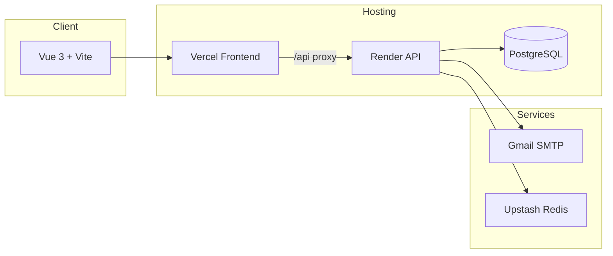

<p align="center">
  
</p>

<h1 align="center">HealthHub</h1>

<p align="center">
  <strong>A modern Hospital Management System — appointments, treatments, and care in one place.</strong>
</p>

<p align="center">
  <a href="https://health-hub-gilt.vercel.app">Live Demo</a> ·
  <a href="https://healthhub-api.onrender.com/health">API Status</a> ·
  <a href="./DEPLOY.md">Deploy Guide</a>
</p>

<p align="center">
  
  
  
  
</p>

---

## Why HealthHub?

HealthHub streamlines day-to-day hospital operations for **patients**, **doctors**, and **admins** through a clean Vue dashboard and a Flask REST API.

| Role | What you can do |
|------|-----------------|
| **Patient** | Book appointments, view treatments, export CSV history, manage profile |
| **Doctor** | Set availability, manage appointments, record diagnosis & prescriptions |
| **Admin** | Add departments & doctors, manage users, view hospital-wide dashboard |

---

## Features

- Secure login with role-based dashboards (patient / doctor / admin)
- Department & doctor management
- Real-time appointment booking with slot availability
- Treatment history, diagnosis, and prescriptions
- CSV export of patient records (emailed when ready)
- Welcome & reminder emails via Gmail SMTP
- Redis-backed sessions & caching (optional)
- Free-tier deployment on **Vercel + Render**

---

## Architecture



---

## Tech Stack

| Layer | Technologies |
|-------|--------------|
| Frontend | Vue 3, Vite, Vue Router, Vuex, Axios, Bootstrap 5 |
| Backend | Flask, SQLAlchemy, Flask-Mail, Flask-Session, Gunicorn |
| Database | PostgreSQL (production) · SQLite (local) |
| Cache / Sessions | Redis (Upstash) or filesystem fallback |
| Email | Gmail SMTP + App Password |

---

## Quick Start (Local)

```bash
# Backend
cd backend
cp .env.example .env          # add MAIL_USERNAME + MAIL_PASSWORD for emails
pip install -r requirements.txt
python app.py                 # http://localhost:5000

# Frontend (new terminal)
cd backend/frontend
npm install
npm run dev                   # http://localhost:5173
```

**Default admin:** `admin@admin.com` / `admin`

---

## Email Setup (Welcome & Notifications)

Welcome emails require Gmail SMTP on your **Render** service:

1. Enable [2-Step Verification](https://myaccount.google.com/security) on Gmail  
2. Create an [App Password](https://myaccount.google.com/apppasswords)  
3. In **Render → healthhub-api → Environment**, set:

| Variable | Value |
|----------|--------|
| `MAIL_USERNAME` | your@gmail.com |
| `MAIL_PASSWORD` | 16-char app password (spaces OK — auto-stripped) |
| `MAIL_SERVER` | smtp.gmail.com |
| `MAIL_PORT` | 587 |
| `MAIL_USE_TLS` | True |

4. Redeploy → sign up with a **new email** → check inbox & spam

---

## Deployment

Full free-tier guide: **[DEPLOY.md](./DEPLOY.md)**

- **Frontend:** Vercel (`backend/frontend`)
- **API + DB:** Render Blueprint (`render.yaml`)
- **Redis:** Upstash (optional)

---

## API Smoke Test

```bash
python backend/scripts/test_endpoints.py https://healthhub-api.onrender.com
```

---

## Project Structure

```
HealthHub/
├── backend/
│   ├── app.py              # Flask entry
│   ├── routes/             # API blueprints
│   ├── models/             # SQLAlchemy models
│   ├── email_utils.py      # Mail helpers
│   └── frontend/           # Vue SPA
├── render.yaml             # Render Blueprint
├── DEPLOY.md
└── README.md
```

---

## Screenshots

| Login | Admin Dashboard |
|-------|-----------------|
| Modern split layout with 3D doctor illustration | Departments, doctors, patients & appointments |

---

## Contributing

1. Fork the repo  
2. Create a feature branch  
3. Commit changes  
4. Open a pull request  

---

## Author

Built as a comprehensive HMS for IITM-style coursework and real-world hospital workflow demos.

<p align="center">
  <sub>HealthHub — caring for patients, empowering doctors, simplifying admin.</sub>
</p>
